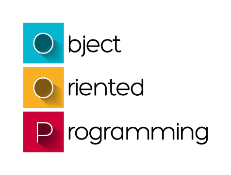

# OOP-practices

## Introduction

This repository contains practical exercises for learning how to write maintenable, testable and scalable code in OOP with Typescript. It includes the 4 pillars, the 5 solid principles.

## Usage:

- Clone this repository.
- Install the typescript dependency with `npm install`.
- You will find exerises under the `src/[topic]` directory: 
    - Implemetations & explanations are directely written as comments in `index.ts` files.
    - You can run an file containing the implementation to see the output with `tsc && node src/[topic]/[path to the file]`.
    - You can change / adapt the implementation for your better understanding as well.

## Contributing

We welcome contributions! If you'd like to contribute to this project, please follow these guidelines:

- Fork the repository and create a new branch.
- Make your changes or add an intersting exercice or even improve existing implemetation / explanation.
- Delete js files generated by typescript.
- Submit your pull request.

Ensure that your code adheres to the project's coding format.
